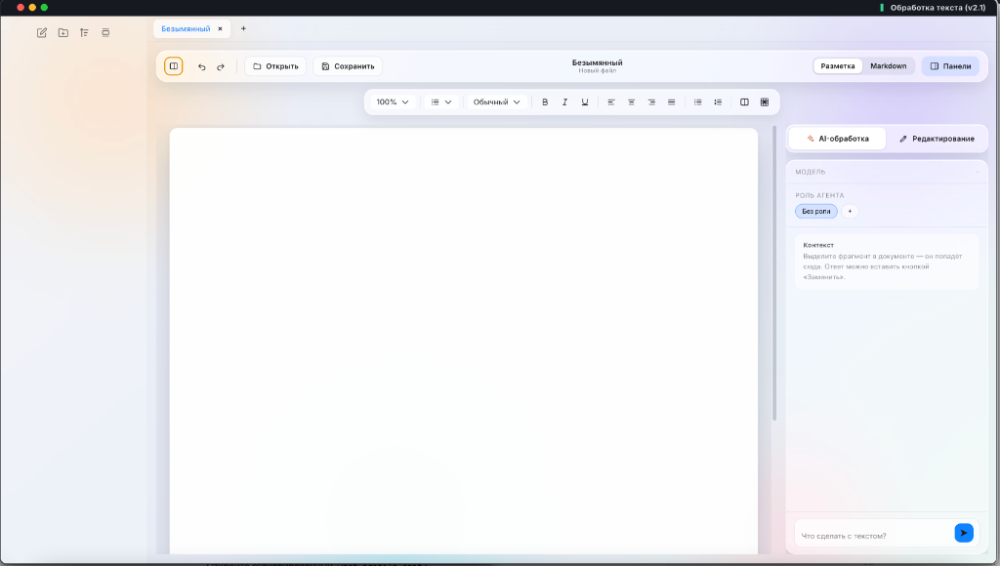
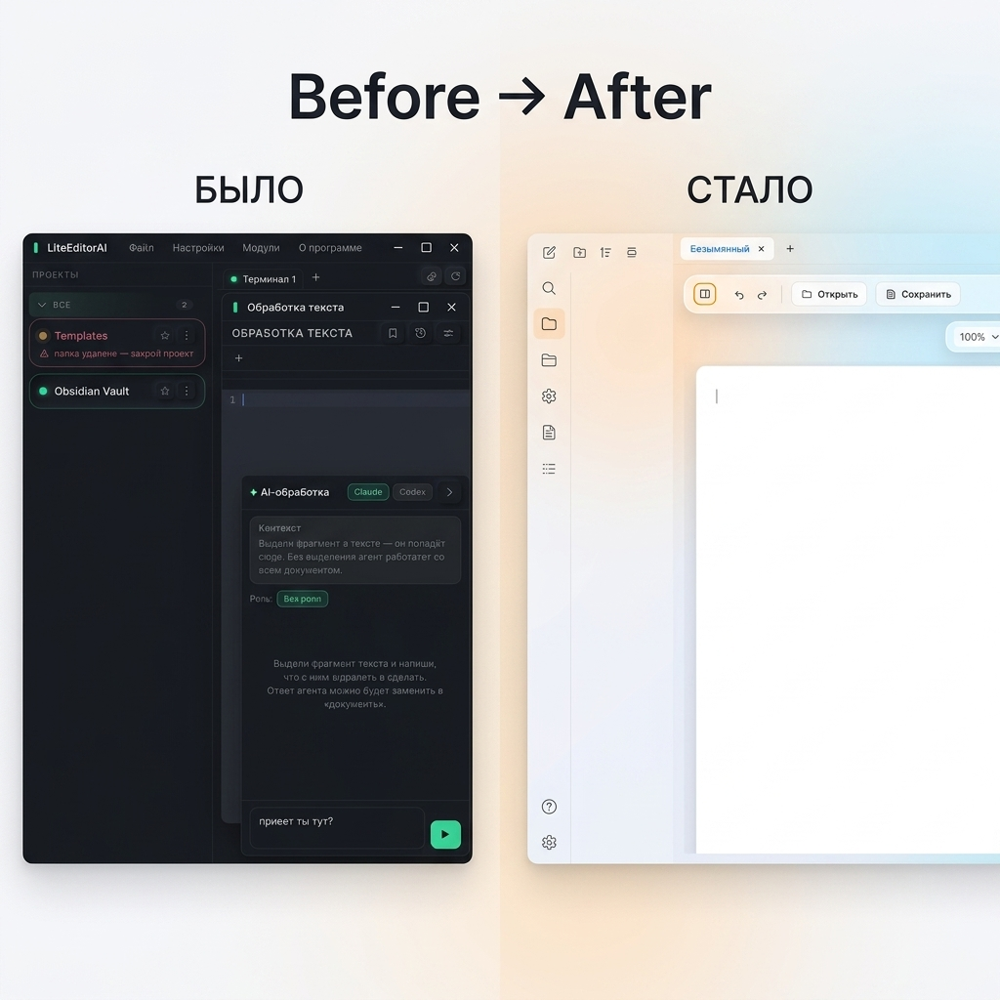

# Модуль «Обработка текста» — LiteEditorAI

## Что это

Полноценная среда для написания и редактирования текстов, встроенная в LiteEditorAI. Акцент сделан на чистом рабочем пространстве: на экране только ваш документ, все инструменты и панели убраны в боковые области и появляются по запросу.

### Было → Стало

---

## Ключевые возможности

### 🤖 AI-ассистент

Справа от документа живёт чат с локальным AI-агентом (Claude Code или Codex). Выделите любой фрагмент текста — он автоматически попадёт в контекст. Напишите, что с ним сделать: переписать, сократить, перевести, упростить. Агент обработает запрос и предложит результат, который можно вставить обратно в документ одной кнопкой «Заменить».

Агент работает **локально на вашей машине** — текст не уходит на внешние серверы и не требует API-ключей.

### 🎭 Роли агента

Вы можете создать собственные роли, которые задают стиль и контекст работы агента:

- **Редактор** — исправляет ошибки и опечатки
- **Корректор** — делает текст более профессиональным
- **Переводчик** — переводит текст на другой язык
- **Юрист** — переписывает в строгом юридическом стиле

Роли хранятся как обычные `.md` файлы в папке `Roles/` вашего проекта. Вы можете добавлять новые роли по кнопке «+», редактировать и удалять существующие через контекстное меню. При первом открытии проекта базовый набор ролей создаётся автоматически.

### ∑ Редактор формул

Полноценная поддержка математических формул на базе KaTeX:

- Палитра из готовых символов (степени, индексы, дроби, интегралы, суммы, греческие буквы, операторы сравнения)
- Живой превью формулы при вводе LaTeX-кода
- Вставка как инлайн-формулы или отдельного блока
- Формулы отображаются прямо в документе в режиме WYSIWYG

### ✍️ Два режима редактирования

- **Разметка (WYSIWYG)** — пишете как в обычном текстовом редакторе, видите результат сразу. Панель форматирования: жирный, курсив, подчёркивание, зачёркивание, заголовки (H1–H3), выравнивание, маркированные и нумерованные списки, цитаты, ссылки, таблицы, блоки кода, цвет текста.
- **Markdown** — переключение в чистый Markdown с подсветкой синтаксиса. Документ конвертируется туда-обратно без потери форматирования.

### 📂 Файловое дерево в стиле Obsidian

Левая боковая панель с деревом файлов проекта. Четыре кнопки быстрого доступа:

- **Новый файл** — создаёт `.md` заметку в корне проекта и сразу открывает в редакторе
- **Новая папка** — создаёт директорию
- **Сортировка** — переключает порядок файлов (А-Я / Я-А)
- **Свернуть все** — моментально закрывает все раскрытые папки

Панель появляется и скрывается плавной анимацией без рывков.

### 📑 Система вкладок

Одновременная работа с несколькими документами через вкладки. Каждая вкладка помнит своё содержимое, имя файла и состояние. Вкладки можно закрывать средней кнопкой мыши (как в браузере). Если документ изменён, но не сохранён — редактор предупредит перед закрытием.

### 🔖 Закладки

Ставьте закладки на важные места в документе и быстро перемещайтесь между ними.

### 🔄 История правок

Полная история изменений документа с возможностью отката к предыдущей версии.

### 🔍 Масштабирование

- Выбор масштаба из выпадающего списка (50%–200%)
- Pinch-to-zoom на тачпаде (Ctrl + колёсико)

### 📏 Настройка типографики

Регулировка межстрочного интервала (от 0.8 до 2.0). Интервалы между абзацами масштабируются автоматически и пропорционально для идеального баланса текста.

---

## Как открыть

В LiteEditorAI: меню **Модули** → **Обработка текста**, или через палитру команд `Ctrl+K`.

## Технические детали

- Фронтенд: `renderer/modules/textproc.js` + `renderer/module.html`
- Стили: `renderer/styles.css` (секция `.tp-*`)
- Иконки: SVG-набор в `renderer/ui.js` (включая Obsidian-стиль)
- Формулы: KaTeX (встроен в бандл)
- Файловые операции: через `lite.fs.*` API (preload → IPC → Node.js)
